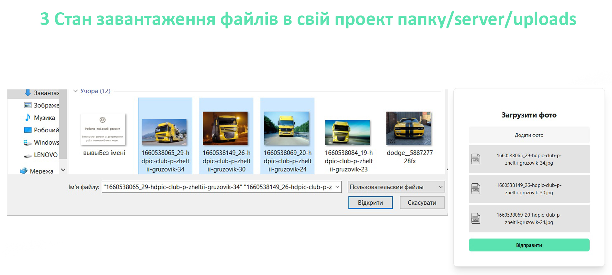

# Функціонал з завантаження фотографій

Реалізован функціонал по завантаженню файлів в проект та відображення (завантажених файлів) на вебсторінці, якій має 4 стани:

- 1 Початковий стан: Функціонал готовий для завантаження фото.
- 2 Стан з обробкою помилки: Коли користувач не завантажував фото, а натиснув кнопку відправити.
- 3 Стан завантаження файлів: Користувач може вибрати для завантаження від 1 до 10 файлів.
- 4 Успішний стан завантаження файлів та їх відображення: Користувач бачить які файли були загружені і при наступному завантажені файлів користувач буде бачити і попередні завантажені файлі і нові.

## Стек технологій:

React + TypeScript + Node

### Запустити проект
- npm run dev (frontend)
- node server/index.js (backend)
